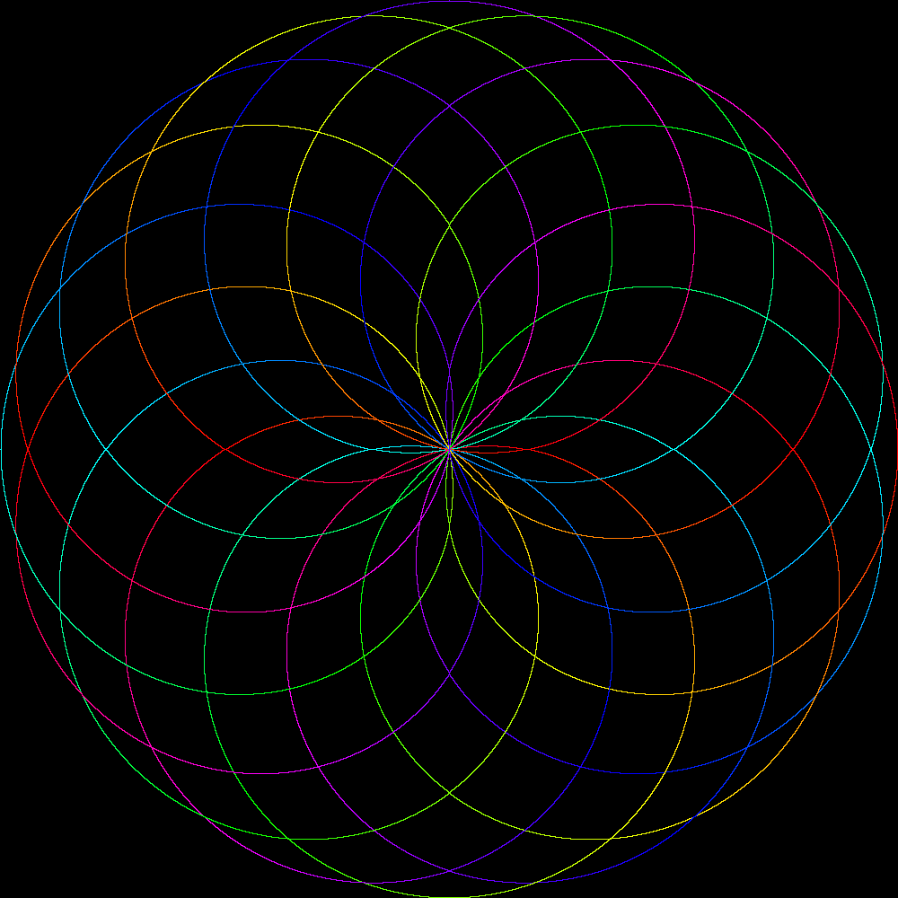

# rose

In mathematics, a rose or rhodonea curve is a sinusoid specified by either the cosine or sine functions with no phase angle that is plotted in polar coordinates. Rose curves or "rhodonea" were named by the Italian mathematician who studied them, Guido Grandi, between the years 1723 and 1728.

[rose on wikipedia](https://en.wikipedia.org/wiki/Rose_(mathematics))

